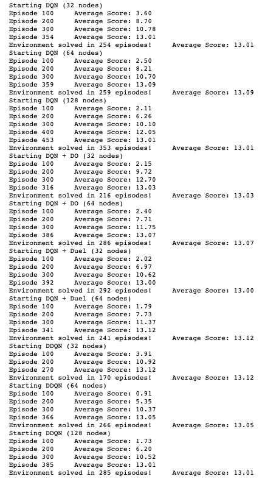
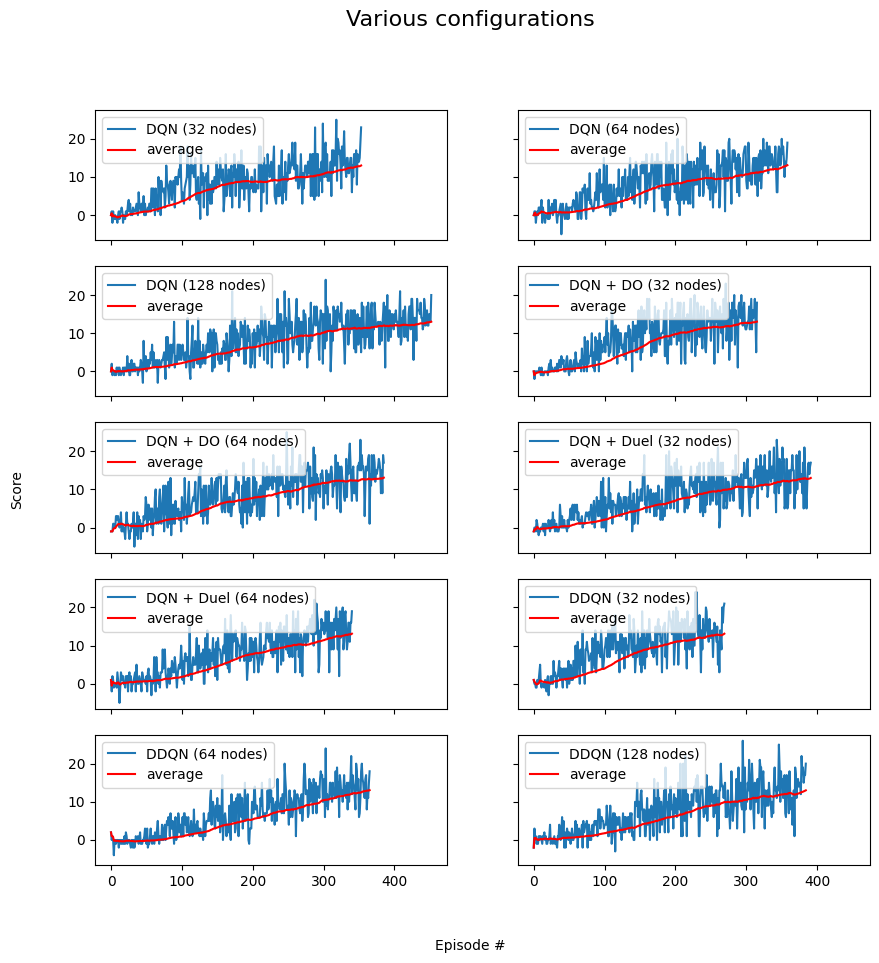

# Udacity Deep RL Project 1 Report: Navigation

GIF of the best performing agent

### Goal

The goal of this assignment was to train an agent in a simple environment using neural networks. The task is considered solved when a score of 13 or more is achieved over 100 consecutive episodes.

### Environment

The project environment is built in Unity and is a version of the Banana Collector, customised for the Udactity Deep Reinforcement Learning nanodegree. There were 37 different state space dimensions with 4 different possible actions. 
Rewards of +1 were accumulated when a yellow banana is collected and -1 when a blue banana is collected. There are no rewards or penalties for moving.
The task is considered solved when a score of 13 or more is achieved over 100 consecutive episodes.

### Approach

The simple Deep Q-Networks, Double Deep Q-Network and Dueling Deep Q-Networks were implemented, which all had a replay buffer.

Q-learning is a form of Temporal Difference (TD) learning, where the agent learns from each step instead of each episode. The state space is continuous and can be represent as a table. Thus a function approximator is used instead. This is were deep learning is used. The function approximator is represented by a neural network. Hence the name Deep Q-Networks (DQN). The Deep Q-Networks algorithm can be highly unstable and the most common methods used to stabilize them are Fixed Q-Targets and an Experience Buffer. An experience buffer was added to our agent, the idea behind it is that we maintain a replay buffer on a certain size and after a few iterations we sample experiences from the buffer and use it to calculate the loss. this random sampling breaks the sequential nature of the experiences and helps to stabilize learning.

Deep Q-Networks are known to overestimate the value function. The idea behind Double Deep Q-Network (DDQN) is that one network is used to find the best action and the other network is used to evaluate the chosen action. Thus if the one network chooses an action by mistake the other network would be able to determine it as a suboptimal action.

Dueling Deep Q-Networks (Duel DQN) use two output stream instead of one as is normal in DQN's. The one output stream is use to calculate the value function for the state while the other is used to calculate the advantage function for that action. The two streams are added together in an aggregated layer.

The architecture of the model was simple. It consisted of two hidden layers with the option to add a dropout layer.

The input layer had the dimension 37x1 for the 37 different state spaces. Next there were two fully connected layers with the number of nodes kept the same and adjustable. There was the option to add a dropout layer between the two fully connected layers to help prevent any over fitting that may occur, this had a dropout probability of 50%.

### Results

10 different configurations were run. The number of nodes, type of network and dropout layers were changed and added. The image below is the output from running all the configurations.

The next image is the plots for each of the configurations 

### Conclusion

Although the DDQN solved the environment the fastest it came with extra complexity,. The simple DQN with drop out and 32 nodes also solved the environment quickly.

The agent didn't perform perfectly, when watching the chosen agent play the game it often got stuck in a loop of choosing between two  actions as can be seen in the GIF below.

GIF of the best performing agent

### Future Improvements

* Find a solution for the agent getting stuck between two actions
* Test the effect of the replay buffer
* Using Prioritized Replay showed
* Hyper-parameter search would lead to better performances 